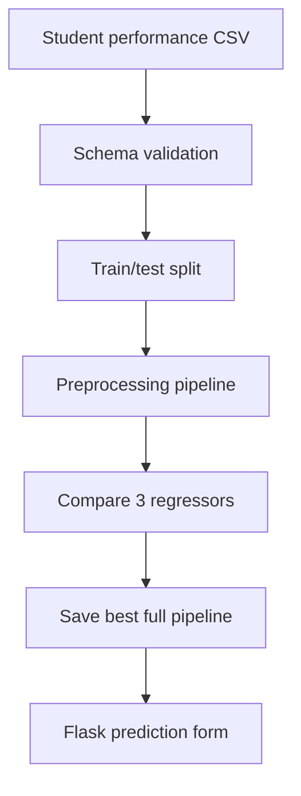

# Student Performance Prediction — End-to-End ML Project

A portfolio-ready machine-learning application that estimates a student's math score from reading and writing scores plus learning-context information. The project covers the complete path from raw data to a tested web application.

> This project was independently rebuilt after studying Krish Naik's [End To End Data Science Project Implementation In One Shot — Part 1](https://www.youtube.com/watch?v=1m3CPP-93RI). It follows the tutorial's learning objective but uses original code, a simplified model stack, tests, CI, Docker support, and a responsible-feature improvement.

## Problem statement

Schools often want to understand how existing academic performance and learning context relate to outcomes in another subject. This project trains regression models to estimate a math score on a 0–100 scale.

It is an educational demonstration, not a production decision system. It must not be used for admissions, grading, ranking, or intervention decisions.

## Responsible design choice

The source dataset includes `gender` and `race_ethnicity`. These fields are deliberately excluded from training and from the web form because sensitive demographic attributes should not determine an individual prediction. The model uses:

- parent/guardian education level
- lunch category
- test-preparation status
- reading score
- writing score

## How the project works



Categorical inputs are imputed and one-hot encoded. Numeric inputs are imputed and standardized. The project compares linear regression, gradient boosting, and random forest using the same split. The model with the highest test R² is saved with its preprocessing pipeline, which prevents training/serving transformation mismatch.

## Project structure

```text
student-performance-ml/
├── .github/workflows/ci.yml     # Automated linting, tests, and training
├── artifacts/                   # Generated model and metrics
├── data/student_performance.csv # Source dataset
├── docs/                        # Presentation and LinkedIn material
├── src/student_performance/
│   ├── config.py                # Paths and feature definitions
│   ├── data.py                  # Dataset loading and validation
│   ├── predict.py               # Validated prediction interface
│   └── train.py                 # Preprocessing, training, and evaluation
├── static/style.css             # Responsive interface styling
├── templates/index.html         # Flask page
├── tests/                       # Unit and application tests
├── app.py                       # Web application entry point
├── Dockerfile                   # Reproducible container
└── requirements.txt             # Runtime dependencies
```

## Local setup

### 1. Clone and enter the project

```bash
git clone YOUR_REPOSITORY_URL
cd student-performance-ml
```

### 2. Create a virtual environment

Windows PowerShell:

```powershell
py -m venv .venv
.venv\Scripts\Activate.ps1
```

macOS/Linux:

```bash
python3 -m venv .venv
source .venv/bin/activate
```

### 3. Install the project

```bash
python -m pip install --upgrade pip
pip install -e .
```

For tests and linting:

```bash
pip install -e ".[dev]"
```

### 4. Train the models

```bash
python -m student_performance.train
```

This command:

1. validates the CSV schema;
2. creates a reproducible 80/20 train-test split;
3. trains three regression pipelines;
4. compares MAE, RMSE, and R²;
5. saves the best pipeline to `artifacts/student_performance_pipeline.joblib`;
6. writes all results to `artifacts/model_metrics.json`.

### 5. Run the web application

```bash
python app.py
```

Open <http://127.0.0.1:5000> in a browser.

## Run tests

```bash
pytest -q
ruff check .
```

## Docker

Build and run without configuring Python locally:

```bash
docker build -t student-performance-ml .
docker run --rm -p 5000:5000 student-performance-ml
```

Then open <http://127.0.0.1:5000>.

## Evaluation metrics

- **MAE:** average size of the prediction error in score points; lower is better.
- **RMSE:** similar to MAE but penalizes larger errors more strongly; lower is better.
- **R²:** proportion of target variation explained by the model; closer to 1 is better.

Verified reference run (Python 3.12, 80/20 split, `random_state=42`):

| Model | MAE | RMSE | R² |
| --- | ---: | ---: | ---: |
| Linear regression | **6.9807** | **8.5745** | **0.6979** |
| Gradient boosting | 7.0091 | 8.6286 | 0.6940 |
| Random forest | 7.4887 | 9.1942 | 0.6526 |

Linear regression won this run. Its MAE means predictions differed from the true math score by about 7 points on average. Results can vary slightly across dependency versions. The machine-readable reference is in `artifacts/model_metrics.example.json`; a fresh run writes `artifacts/model_metrics.json`.

## Example prediction

```python
from student_performance.predict import PerformancePredictor, StudentInput

student = StudentInput(
    parental_level_of_education="bachelor's degree",
    lunch="standard",
    test_preparation_course="completed",
    reading_score=78,
    writing_score=81,
)

score = PerformancePredictor().predict(student)
print(score)
```

## Challenges and lessons

- Keeping preprocessing and inference identical is safer when both are stored in one scikit-learn `Pipeline`.
- Comparing models with the same test split makes the evaluation fair.
- Input validation is necessary even for a small demonstration application.
- A good ML project includes reproducibility, testing, documentation, and responsible-use boundaries—not only a notebook.
- Sensitive features can be present in a dataset without being appropriate prediction inputs.

## Dataset

The included 1,000-row **Students Performance in Exams** dataset contains math, reading, and writing results with background categories. It is commonly published on Kaggle and is included here to make the educational workflow reproducible. The copy used for this implementation was obtained from the tutorial's accompanying public repository.

## License

Code is released under the [MIT License](LICENSE). Check the original dataset source and terms before any use beyond education or demonstration.
